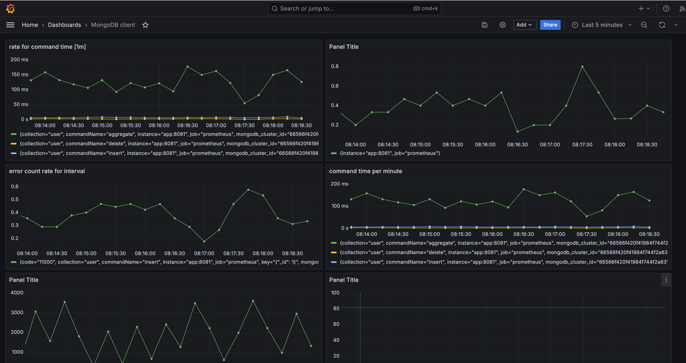

# MongoDB Command Metrics Monitor
## Overview
MongoMetricCommandListener is a Spring Boot component that monitors MongoDB command events, capturing metrics such as command success, error rates, and execution times. These metrics are recorded using Micrometer and can be visualized through various monitoring tools supported by Micrometer.

## Features
Command Success and Error Counters: Tracks the number of successful and failed MongoDB commands.
Command Timing: Measures the execution time of MongoDB commands.
Slow Query Detection: Identifies slow queries (default threshold: 1000ms) and records their occurrence and duration.

## Demo

## Requirements
- Java 17 or higher
- Spring Boot 2.3 or higher
- MongoDB Java Driver 4.x
- Micrometer 1.5 or higher

Contributing
Contributions are welcome! Please submit a pull request or open an issue to discuss potential changes.
